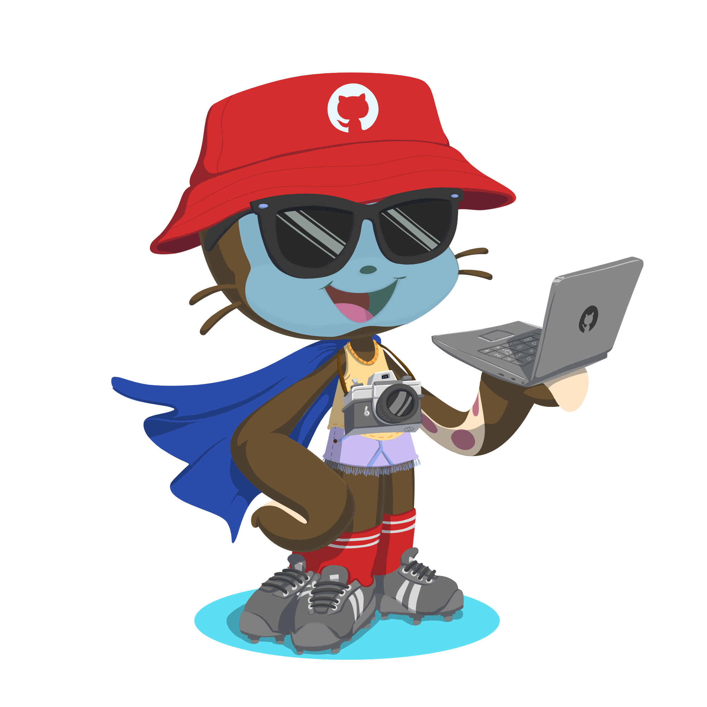

<h1 align="center">Hi 👋, I'm Rohit</h1>

  

- 👨‍💻 Software Developer

- 🔭 I’m currently working on **SAP ABAP**

- 🌱 Learning Never Ends..........

- 👨‍💻 All of my projects are available at [https://itz-predator.github.io/rohit-vns/](https://itz-predator.github.io/rohit-vns/)

- 📫 How to reach me **https://www.linkedin.com/in/rohitks1/**

## 🛠 &nbsp;Tech Stack

- 💻 &nbsp;
  
  
  
  
  
- 🌐 &nbsp;
  
  
  
  
   
- 🛢 &nbsp;
  
  
- ⚙️ &nbsp;
  
  
- 🔧 &nbsp;
  
